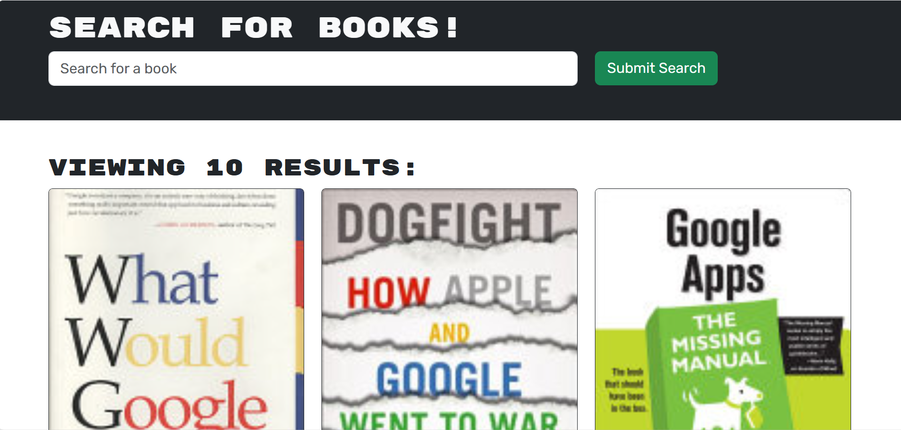

# 21 MERN: Book Search Engine

## Your Task

This project features a book search engine that uses GraphQL API built with Apollo Server. The app was built using the MERN stack with a React front end, MongoDB database, and Node.js/Express.js server and API. The application was refactored from RESTful API.

# Instructions
run 

```
npm i
```
in root, client and server directory.

then run 
``` 
npm run develop 
```
# ScreenShots




